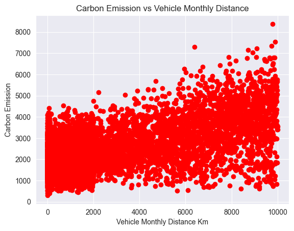
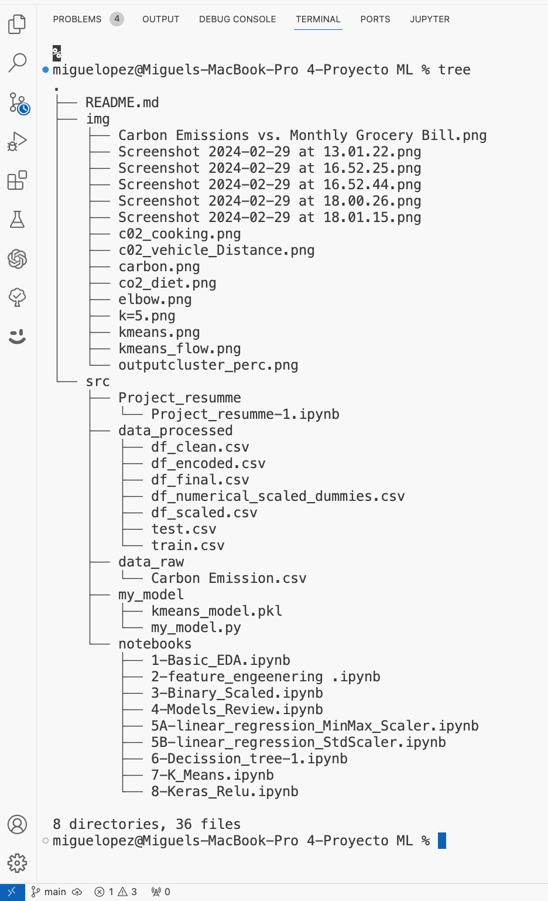

 
  

<h1 align="center"> USING MACHINE LEARNING TO PREDICT CARBON FOOT PRINT </h1>
<h3 align="center"> This multifaceted dataset covers a broad range of features related to individual habits, lifestyle choices, demographics, and environmental impacts. In particular, it focuses on factors that contribute to carbon emissions like diet, transportation usage, energy sources, and consumption patterns. Additionally, it includes personal attributes such as body type, gender, and social activity levels. With over 50 features capturing environmental impacts alongside demographic and behavioral traits, this diverse dataset enables targeted marketing and customer segmentation analysis.

 </h3>  

 

 
  

<!-- TABLE OF CONTENTS -->
<h2 id="table-of-contents">Table of Contents</h2>

  
Table of Contents

  <ol>
    <li><a href="# Block-1-Data-Analysis"> ➤ INTRODUCTION</a></li>
    <li><a href="#prerequisites"> ➤ Prerequisites</a></li>
    <li><a href="#folder-structure"> ➤ Folder Structure</a></li>
    <li><a href="#Contact"> ➤ Contact</a></li>
    
<!-- ABOUT THE PROJECT -->
<h2 id="about-Blo"> INTRODUCTION </h2>

 

This rich dataset supports a multifaceted understanding of customer characteristics. It empowers green marketing strategies and allows brands to engage consumers with relevant sustainability-oriented products and messaging. The data provides critical insights to customize branding, pricing, promotions, and climate-friendly offerings by customer segment. 

  In this notebook, i will explore various models to determine whether this dataset is better suited for supervised or unsupervised learning. The goal is to identify the most effective method for developing carbon emission-friendly solutions and commercial applications. By the end of this analysis, i aim to have a clear understanding of the best approach for further development. 

Please review summary in "/source/project_resumme",  for a brief overview of the model techniques and their applications in this project.

 
          
          
  

<!-- PREREQUISITES -->
<h2 id="prerequisites"> Prerequisites</h2>

  
  

<!--This project is written in Python programming language.  -->
The following open source packages are used in this project:
* Numpy 
* Pandas 
* Matplotlib 
* Scikit-Learn 
* Seaborn 
* KMeans 
* skLearn 
* Tensorflow 
* ast 
* os 
* seaborn 

<!-- FOLDER STRUCTURE -->
<h2 id="folder-structure"> Folder Structure</h2>

 
  

<h2 id="Contact"> Contact</h2>

Juan Miguel López Piñero

  

 
            
            
  

